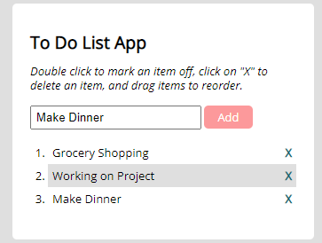

# To-Do-List-App

This is a basic to-do-list app using jQuery.

# Key Features

- Adding a task by pressing the add button.
- Marking a task as done by double clicking the task.
- Deleting the task by clicking the x.

# Built With:

- HTML
- CSS
- JavaScript
- jQuery
